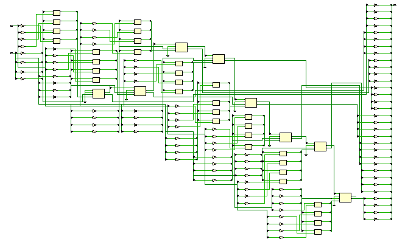
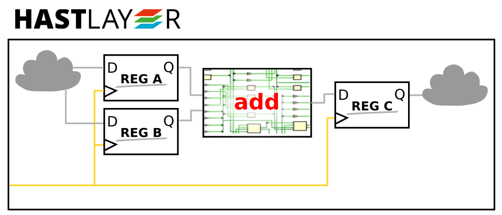
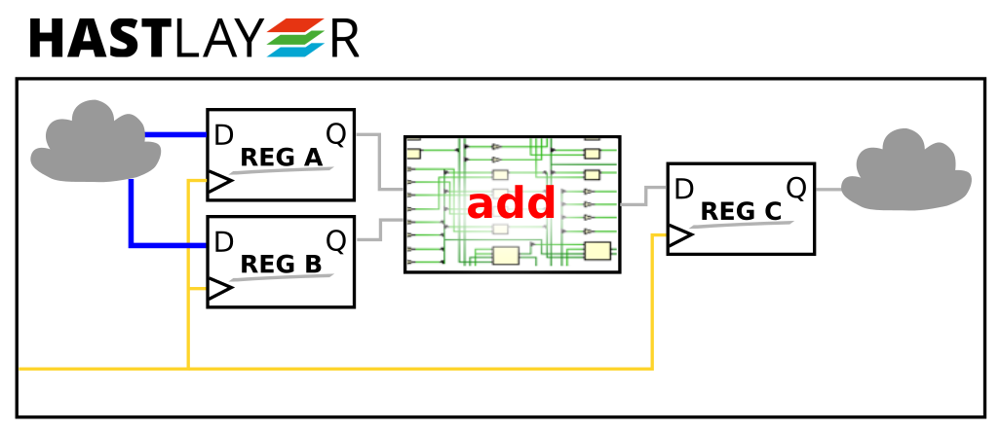
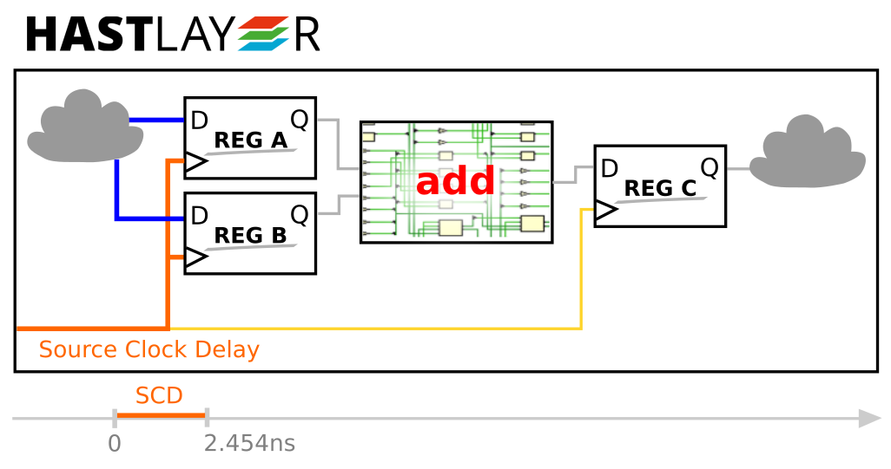
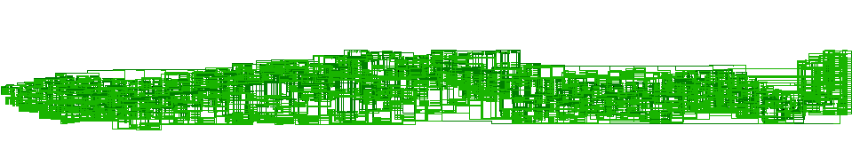
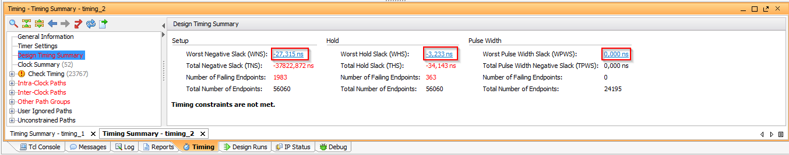
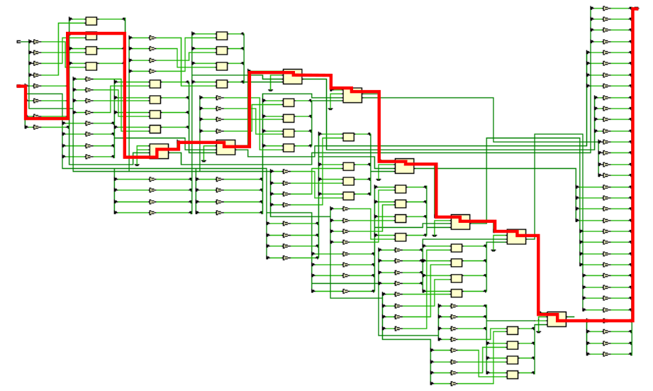

# Introduction

## What does Hastlayer Timing Tester do?

The Hastlayer Timing Tester is for automatically calculating the timing properties for different operations. 
It will estimate that if we upload the compiled design to an FPGA, how much time it takes an operation to complete on real hardware. 
It uses the Static Timing Analysis (STA) engine in Vivado to calculate these values. 
It helps us to avoid setup time violations in the generated Hastlayer hardware design.

## What problem does it solve?

To understand the basic concepts, read [this guide](https://embeddedmicro.com/tutorials/mojo/timing).

In very short, the compiler maps the VHDL/Verilog code to hardware resources in the FPGA. These resources (including CLBs, BRAMs, DSP slices, etc.) consist of transistors at the very low level.

**Transistors need some time to switch on/off** because the parasitic capacitances in the electronic circuit on silicon need to charge or discharge. This has always been a limiting factor in the maximum computing speed that can be achieved with digital electronic circuits.  

## Why is timing important?

**If there are timing problems in the design, it might not work as expected**, even though the simulation verifies that it is correct. While timing problems can produce different kinds of errors, I will show an example that is relevant to Hastlayer.

Hastlayer can be viewed as a sequential, synchronous logic circuit.
* A **sequential logic** means that the logic circuit has some outputs feedback to its input. (See the image [at this page](http://www.c-jump.com/CIS77/CPU/Sequential/lecture.html).)

* A **synchronous circuit** means that the circuit gets into a different state for every single clock cycle. The state of the system is stored in flip-flops, the output of which is feedback to its input.  (See the image [at this page](http://www.ee.surrey.ac.uk/Projects/CAL/seq-switching/synchronous_and_asynchronous_cir.htm).)

Indeed, a CPU is also a sequential, synchronous logic circuit (the state consists of e.g. the last opcode fetched, the content of the registers, and many other things).

As a sequential, synchronous logic circuit, Hastlayer can also be viewed as a giant state machine, changing state for every clock cycle.

Let's see just a small part of the this logic chain:

This would have been generated from the following add operation:

    c <= a + b; -- all operands are unsigned(31 downto 0)

It takes around 7 ns to propagate through all the paths of the design.

How does this propagation happen exactly? 
Let's start out with this system:

Let's say the the data on the input ports of `add` is already available (shown in blue).

Now it takes some time for the system to propagate the clock signal to `reg A`. This is called *Source Clock Delay*.

> You will find the same terminology in Vivado Timing Report and Timing Summary.

Propagation of the signals through the *add* operation and the nets around it also takes time. This is called *Data Path Delay*.

The output of the adder is sampled at the next clock rising edge. However, again have to take into consideration that the clock signal going to register `c` is delayed through its path. This is called *Destination Clock Delay*, and is usually not the same as the *Source Clock Delay*, as the signal goes a different path.

A flip-flop has a so-called setup-hold window:
* the D input signal should not change for some time before the clock rising edge,
* the D input signal should not change for some time after the clock rising edge.

That's the **FF Setup Time** on the image below.

(Here we are talking about an edge-triggered flip-flop that changes state at the rising edge, like the FDRE basic element of logic.),

> Note that [this forum thread](https://forums.xilinx.com/t5/Timing-Analysis/I-was-fogged-by-the-data-required-time-in-Vivado/td-p/424596) details why Vivado timing analysis might seem to report the *FF Setup Time* in the opposite direction sometimes.

Other factors to be taken into consideration are the **Clock Uncertainty**, which means that the clock may not be on time, it may arrive a bit faster or slower. For example, the crystal oscillator on the circuit board has a given accuracy.

**Common Clock Pessimism Removal** is detailed in [this Xilinx AR](http://www.xilinx.com/support/answers/50450.html). The concept behind it is that we do not know the exact delay that those elements introduce that the clock signal and the data goes through. We know however a minimum and a maximum delay that each can introduce. To do the check for the worst scenario:
* when calculating the *Source Clock Delay* and the *Data Path Delay*, we use the *maximum delays* that these elements can introduce,
* when calculating the *Destination Clock Delay*, we use the *minimum delays* that these elements can introduce.
However, the clock for the launching and capturing flip-flop is usually the same signal. *Common Clock Pessimism Removal* is there to compensate for this.

Okay, so we see that the signal arrives on time to the D input of the second flip-flop:

Now let's see what happens if we subsitute the `+` operation with `mod`?

    c <= a mod b; -- all operands are unsigned(31 downto 0)

The given part of the system will look like this:

Wow, that's quite complex. And it takes more that 80 ns for the signal to propagate through it.

Okay, let's draw the new timing diagram:

Oops, the signal is terribly overtime.

What will happen if we compile a design like this, and load it into the FPGA?

It is likely that `c` will contain an incorrect value. Or it might not.
It can also happen the output is incorrect for some inputs, but it isn't for others.

This type of error is called a **setup time violation**. (In FPGA designs, there are other possible timing errors in general, but this is the type of error that Hastlayer Timing Tester helps to fix.)

## How do we know that we have such an error in our design?

After the design is compiled, we can get a *Timing Summary* from Vivado. It uses a method called **Static Timing Analysis (STA)** to check for timing problems in the design. If our slack values are negative, we have a problem. Setup time violations refer to the *Worst Negative Slack* and *Total Negative Slack* values on the following image.

STA finds the critical path in the design. While there are many paths in the design, the critical path is the slowest one. This is the one that the *Data Path Delay* corresponds to.

Only for illustration, you can imagine something like this:

## What can we do with it?

We can:
* run the whole system from a lower clock frequency, but that would decrease the processing speed,
* wait multiple cycles for the operation to complete (multi cycle path),
* use pipelining to make the paths shorter,
* use different hardware resources for the same operation (e.g. use a DSP slice instead of a chain of LUTs),
* etc.
