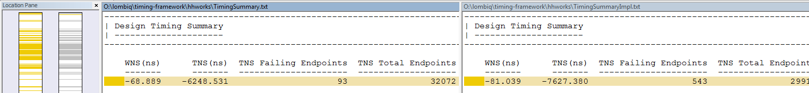

# Usage


## What you will need

Hastlayer Timing Tester requires **Visual Studio Community Edition 2017 (Version 15.4.4) or greater** to run. (You will need to recompile the project from source if you edit the configuration.)

In case you are using Hastlayer on Xilinx platform, you will need **Xilinx Vivado 2016.4**.

On Microsoft Catapult, you will need **Altera (Intel) Quartus Prime and TimeQuest, version 15.1**

> While cloning the repository or unpacking the project, make sure that there are no special characters in the path (as Vivado cannot handle them, e.g. it can fail with: `TclStackFree: incorrect freePtr. Call out of sequence?`).


## How to configure

To configure Hastlayer Timing Tester, you will have to edit the source file `TimingTestConfig.cs`, the options of which are detailed in comments.

> What is the reason for doing it in the source instead of a JSON or XML file? Well, we can have lambda functions as part of the configuration.

> You can generate different configurations by adding new classes that have `TimingTestConfigBase` as their parent. However, the class to be used is specified in `Main()` in `Program.cs`.

# How to run

After building the project, you can run `HastlayerTimingTester.exe`, which is a console application that has some command line parameters, as detailed below. 

Hastlayer Timing Tester has three different processing stages:

1. **Prepare** (`--prepare`, `-p`): generate VHDL and constraint files (XDC/SDC), and a batch file that will start Vivado or Quartus to run the next step.

2. **Execute STA** (`--exec-sta`, `-e`): run the batch file generated in the first step. (The user can choose to do this manually.) In this step, Vivado/Quartus will synthesize the design, generate a timing summary and a timing report.

3. **Analyze** (`--analyze`, `-a`): process the STA results (after running the batch file). In this step, Hastlayer Timing Tester will parse the timing summaries and the timing reports, and display the most important values. These are also saved into the `Results.tsv` file for later processing.

The `--all` or `-x` switch runs all the steps above (1-3). 

The `--all-remote-sta` or `-r` switch runs step 1, then waits for the user to run the script manually on the local or remote machine, then runs step 3.


# Operation

Hastlayer Timing Tester will go through:

* each operator,
* each input size,
* each input data type,
* each VHDL template,

...and generates, runs, then analyzes tests for all combinations of them.


## Output

Hastlayer Timing Tester will generate a similar directory structure:

    └─ CurrentTest
       └─ add_unsigned32_to_unsigned32_sync # This directory contains an actual test case for a given operator,
       |  |                                 # input and output operands, and VHDL template.
       |  ├─ UUT.vhd            # This is the VHDL code of the design to be tested.
       |  ├─ Constraints.xdc    # (Only for Vivado) These are the constraints of the design to be tested.
       |  ├─ Constraints.sdc    # (Only for Quartus) These are the constraints of the design to be tested.
       |  ├─ Schematic.pdf      # (Only for Vivado) This is a zoomable PDF that contains a block diagram of the low level hardware resources used.
       |  ├─ TimingReport.txt   # (Only for Vivado) This is the timing report generated by Vivado.
       |  ├─ TimingSummary.txt  # This is the timing summary generated by Vivado / Quartus.
       |  └─ SetupSummary.txt   # (Only for Quartus) This is the setup timing summary generated by Quartus.
       ├─ Log.txt       # A log file is generated in prepare and analyze stages. It contains the results of all tests.
       ├─ Results.tsv   # This file contains the final results of all tests, in a format that can be easily imported into spreadsheet editors.
       ├─ Generate.tcl  # (Only for Vivado) A Tcl script ran inside Vivado, in order to compile the design to be tested and run the timing analysis on it.
       ├─ Quartus.tcl   # (Only for Quartus) A Tcl script ran inside Quartus, in order to compile the design to be tested.
       └─ TimeQuest.tcl # (Only for Quartus) A Tcl script ran inside TimeQuest, in order to run the timing analysis on the design to be tested.

The following part is a sample analysis output for a test:

```
=== HastlayerTimingTester analyze stage ===
Started at 2017-12-03 22:46:11

Current test item: shift_left, 8, std_logic_vector(7 downto 0) to std_logic_vector(7 downto 0)
    Dir name: shift_left_std_logic_vector8_to_std_logic_vector8_sync

Synthesis:
----------
Timing Report:
    S>> Data path delay = 0.812 ns  (0.081 cycle at 100 MHz clock)
    Source clock delay = 2.372 ns
    Requirement for arrival = 10 ns
    Requirement plus delays = 11.971 ns
    Timing window available = 9.599 ns
    S>> Timing window diff from requirement = -0.401 ns  (-0.04 cycle at 100 MHz clock)
    Max clock frequency = 824.402 MHz 
Timing Summary:
    Design PASSED meeting timing requirements
    Worst Setup Slack = 8.788 ns
    Total Setup Slack = 0 ns
    Worst Hold Slack = 0.152 ns
    Total Hold Slack = 0 ns
    Worst Pulse Width Slack = 4.5 ns
    Total Pulse Width Slack = 0 ns
    (Any "worst slack" is okay if positive,
        any "total slack" is okay if zero.)

(...)
```

The important values that the Transformer can make use of are prefixed with `>>`.


## What does this mean at all?

Some of these values are explained in the [introduction](Introduction.md), make sure to read it first.

**Data path delay** is the sum of:

* the delay caused by the actual operator,
* the launching flip-flop (which is the input to the operator) clock-to-Q time (the time from the clock rising edge to a valid output on Q).

It is important, because this is how much time it takes to get a stable output from the logic that implements the operator.

However, we have to take it into consideration that:

* the clock signal goes on different paths to the launching and the capturing flip-flop,
* the delay of these paths is between given minimum and maximum values (see "Clock Pessimism" in [the introduction](Introduction.md)),
* the capturing flip-flop has a setup time.

These are summed up in the **Timing window diff from requirement** parameter (abbreviated as TWDFR on the figures).

Let's see this for the test result above:


This means that we could either increase the clock frequency without having a setup time violation:


...or we could introduce more operations that depend on the output value of the original one, all into the same clock cycle:


This also answers the question **how can the Transformer make use of these results**.

If we increased the clock frequency too much, or had too much operations after each other in the same cycle, that would result in a **setup time violation** that we want to avoid:


However, it raises even more questions:

* **Q:** If we chain operations after each other, which *Timing Window diff from requirement* to choose?
* **A:** This has not been analyzed yet. Right now I think that we should choose the maximum out of them. However, it is an advanced question and it is hard to say how the compiler's behaviour in a situation like this will change this value. (Also see the other limitations at the bottom of the page.) This is why it is important to emphasize that Hastlayer Timing Tester is giving approximations. If we end up using timing margin similar to Vivado HLS, that might simplify this problem.
* **Q:** Is it valid to add up Data Path Delays this way? A Data Path Delays for each operation correspond to their critical paths. Nothing ensures that using multiple operations after each other will connect the critical paths together.
* **A:** Yes, but it is not likely that multiple operations after each other will have a longer critical path than the sum of the lengths of their separate critical paths.

> **Note:** the TWDFR value in `Results.tsv` is normally a negative number. It is used just opposite to the value shown on the images above. We need to add this negative number to the clock cycle duration (also called *Requirement*) to get the duration of the *Timing Window*, in which the sum of the DPD of all operations in a given cycle need to fit into.


## Limitations of the analysis

When the synthesis ends, we know how many hardware resources will be used (e.g. LUT, FDRE, DSP48E, etc.) and how they will be connected together. However, mapping these resources to real hardware has not been done yet.

Accurate timing information can only be acquired after the implementation stage. At synthesis, we can only have approximations.

As an example of this, let's see the differences of timing summaries between only synthesized and already implemented versions of Hastlayer:



In this case, the negative setup slack is ~20ns worse in the implemented design.

Sometimes the critical path will change to a different one after implementation, because it turns out that other path happens to be worse after place and route.

The Haslayer Timing Tester tool gets the generated test code synthesized and implemented with Vivado, and checks STA at both stages. It uses the results acquired from the implementation stage unless Vivado failed to implement the design, or if `DPD + TWDFR` is higher for synthesis. The source of the results is clearly visible in `Results.tsv`. 

However, if the project size increases (e.g. by adding the Microblaze soft CPU and other IP cores that are required to run Hastlayer), it will make the compiler think harder to get everything routed, and often it will use more net resources, thus include more delays in the design. This behaviour can not be easily tested or approximated yet, because it depends very much on all the other logic used in the project.

(For Quartus, Hastlayer Timing Tester only supports implementing the project, and running STA after that. In this case, you will not get STA results from between synthesis and implementation.)

----

Another limitation of this tool is not doing any further analysis on hold time and minimum pulse width violations (although these are reported). However, we have not had problems related to these in Hastlayer yet.

Additional research has been carried out about hold violations, the result of which can be found on the [Lombiq Wiki (Timing on Catapult)](https://lombiq.atlassian.net/wiki/spaces/HAST/pages/186744859/Timing+on+Catapult).


## The meaning of other parameters

For **Data path delay** and **Source clock delay** check [the introduction](Introduction.md).

**Requirement for arrival** is usually the clock period.

** Requirement plus delays** = *Requirement for arrival* + *Destination clock delay* - *FF Setup Time* - *Clock Uncertainty* + *Clock Pessimism*

**Timing window available** = *Requirement plus delays* - *Source clock delay*

> Note: this term is not industry standard. Giving this parameter a name made things easier.

**Timing window diff from requirement** = *Timing window available* - *Requirement for arrival*

> Note: this term is not industry standard. Giving this parameter a name made things easier.

**Max clock frequency** is the estimated maximum clock frequency at which the test design (that contains only one operator) could be used. It works like this:


This figure will hopefully make it clear where do some of these parameters come from:


## Questions

* Q: What is the difference between `VhdlTemplateSync` and `VhdlTemplateComb`?
* A: `VhdlTemplateComb` is a pure design without a clock. Only the operator is there. In the synthesized design, the inputs are connected to IBUFs and the outputs are connected to OBUFs, which add a lot of time to the *Data Path Delay*. `VhdlTemplateSync` was added because I decided that calculating the operator once for every clock cycle, feeding its inputs and capturing its output with flip-flops is more realistic, as this is what happens in Hastlayer. Also Vivado can output more timing information for a design like that. I recommend using this template.
