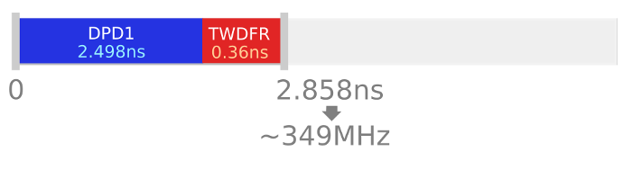

# Usage

## What you will need

* Visual Studio Community Edition 2015 (Version 14)
* Xilinx Vivado 2016.2

## How to configure

To configure Hastlayer Timing Tester, you will have to edit the source file `TimingTestConfig.cs`, the options of which are detailed in comments.

> What is the reason for doing it in the source instead of a JSON or XML file? Well, we can have lambda functions as part of the configuration.

> You can generate different configurations by adding new classes that have `TimingTestConfigBase` as their parent. However, the class to be used is specified in `Main()` in `Program.cs`.

## How to run
After building the project, you can run `HastlayerTimingTester.exe`.

Hastlayer Timing Tester is a console application that does not need any command line parameters.

# Operation

While running, Hastlayer Timing Tester will go through:

* each operator,
* each input size,
* each input data type,
* each VHDL template,

...and performs tests for all combinations of them.

For every test, Hastlayer Timing Tester will:

* synthesize the design,
* generate a timing summary and a timing report,
* parse the timing summary and the timing report, and display the most important values.

## Output

Hastlayer Timing Tester will generate a similar directory structure:

    ├─ VivadoFiles # This directory stores the temporary files used for compiling a test. It will be cleared before every run.
    └─ TestResults
       └─ 2016-09-09__11-37-08__default # A new directory is generated for output files at every run.
          |                             # The name of this directory includes the current date and time, and TimingTestConfigBase.Name as well.
          └─ add_unsigned32_to_unsigned32_sync # This directory contains an actual test case for a given operator,
          |  |                                 # input and output operands, and VHDL template.
          |  ├─ UUT.vhd            # This is the VHDL code of the design tested.
          |  ├─ Constraints.xdc    # This are the constraints of the design tested.
          |  ├─ Schematic.pdf      # This is a zoomable PDF that contains a block diagram of the low level hardware resources used.
          |  ├─ TimingReport.txt   # This is the timing report generated by Vivado.
          |  └─ TimingSummary.txt  # This is the timing summary generated by Vivado.
          └─ Log.txt # A log file is generated that contains the results of all tests.

The following part is a sample console output for a test:

    ========================== starting test ==========================
    Now generating: gt(>), 32, unsigned(31 downto 0) to boolean
    	Dir name: gt_unsigned32_to_boolean_sync
    Running Vivado... Done.
    Timing Report:
    	>> Data path delay = 2.498 ns
    (0.2498 cycle at 100 MHz clock)
    	Source clock delay = 2.372 ns
    	Requirement for arrival = 10 ns
    	Requirement plus delays = 12.009 ns
    	Timing window available = 9.637 ns
    	>> Timing window diff from requirement = -0.3629999 ns
    		(-0.03629999 cycle at 100 MHz clock)
    	Max clock frequency = 349.5282 MHz
    Timing Summary:
    	Design PASSED meeting timing requirements
    	Worst Negative Slack = 7.139 ns
    	Total Negative Slack = 0 ns
    	Worst Hold Slack = 0.29 ns
    	Total Hold Slack = 0 ns
    	Worst Pulse Width Slack = 4.5 ns
    	Total Pulse Width Slack = 0 ns
    	(Any "worst slack" is okay if positive,
    		any "total slack" is okay if zero.)

The important values that the Transformer can make use of are prefixed with `>>`.

## What does this mean at all?

Some of these values are explained in the [introduction](Introduction.md), make sure to read it first.

**Data path delay** is the sum of:

* the delay caused by the actual operator,
* the launching flip-flop (which is the input to the operator) clock-to-Q time (the time from the clock rising edge to a valid output on Q).

It is important, because this is how much time it takes to get a stable output from the logic that implements the operator.

However, we have to take it into consideration that:

* the clock signal goes on different paths to the launching and the capturing flip-flop,
* the delay of these paths is between given minimum and maximum values (see "Clock Pessimism" in [the introduction](Introduction.md)),
* the capturing flip-flop has a setup time.

These are summed up in the **Timing window diff from requirement** parameter (abbreviated as TWDFR on the figures).

Let's see this for the test result above:

This means that we could either increase the clock frequency without having a setup time violation:

...or we could introduce more operations that depend on the output value of the original one, all into the same clock cycle:

This also answers the question **how can the Transformer make use of these results**.

However, it raises even more questions:

* **Q:** If we chain operations after each other, which *Timing Window diff from requirement* to choose?
* **A:** This has not been analyzed yet. Right now I think that we should choose the maximum out of them. However, it is an advanced question and it is hard to say how the compiler's behaviour in a situation like this will change this value. (Also see the other limitations at the bottom of the page.) This is why it is important to emphasize that Hastlayer Timing Tester is giving approximations. If we end up using timing margin similar to Vivado HLS, that might simplify this problem.
* **Q:** Is it valid to add up Data Path Delays this way? A Data Path Delays for each operation correspond to their critical paths. Nothing ensures that using multiple operations after each other will connect the critical paths together.
* **A:** Yes, but it is not likely that multiple operations after each other will have a longer critical path than the sum of the lengths of their separate critical paths.

## Limitations of the analysis

This tool performs STA after synthesis. At this point we know how many hardware resources will be used (e.g. LUT, FDRE, DSP48E, etc.) and how they will be connected together. However, mapping these resources to real hardware has not been done yet.

Accurate timing information can only be acquired after the implementation stage. At synthesis, we can only have approximations.

As an example of this, let's see the differences of timing summaries between only synthesized and already implemented versions of Hastlayer:

In this case, the negative setup slack is ~20ns worse in the implemented design.

Sometimes the critical path also changes after implementation, because it turns out that a different path happens to be worse after place and route.

----

Another limitation of this tool is not doing any further analysis on hold time and minimum pulse width violations (although these are reported). However, we have not had problems related to these in Hastlayer yet.

## The meaning of other parameters

For **Data path delay** and **Source clock delay** check [the introduction](Introduction.md).

**Requirement for arrival** is usually the clock period.

** Requirement plus delays** = *Requirement for arrival* + *Destination clock delay* - *FF Setup Time* - *Clock Uncertainty* + *Clock Pessimism*

**Timing window available** = *Requirement plus delays* - *Source clock delay*

> Note: this term is not industry standard. Giving this parameter a name made things easier.

**Timing window diff from requirement** = *Timing window available* - *Requirement for arrival*

> Note: this term is not industry standard. Giving this parameter a name made things easier.

**Max clock frequency** is the estimated maximum clock frequency at which the test design (that contains only one operator) could be used. It works like this:

## Other questions

* Q: What is the difference between `VhdlTemplateSync` and `VhdlTemplateComb`?
* A: `VhdlTemplateComb` is a pure design without a clock. Only the operator is there. In the synthesized design, the inputs are connected to IBUFs and the outputs are connected to OBUFs, which add a lot of time to the *Data Path Delay*. `VhdlTemplateSync` was added because I decided that calculating the operator once for every clock cycle, feeding its inputs and capturing its output with flip-flops is more realistic, as this is what happens in Hastlayer. Also Vivado can output more timing information for a design like that. I recommend using this template.

## Lessons learned

* I have observed that there is no difference in timing if we compile a design in project mode or non-project mode in Vivado. This is important becaue it means that Vivado does not apply hidden settings while creating a project with the GUI.
* *Timing window diff from requirement* does not change if the same design is compiled using a different clock frequency. (A small difference is introduced by the precision of floating point operations.)
* While `Setup_fdre_C_D` is expected to be negative, Vivado sometimes says that it is positive [(more here)](https://forums.xilinx.com/t5/Timing-Analysis/I-was-fogged-by-the-data-required-time-in-Vivado/td-p/424596). Anyway, we use the end result (*Requirement plus delays*), so it does not screw up anything.
* If the critical path ends in a DPS48E1, *Timing window diff from requirement* will be much higher as the setup time of the DSP48E1 (~1.4ns) is higher than of the flipflops (0.06-0.183ns). Example for this: `mul_unsigned32_to_unsigned64_sync` (with -1.58ns of *Timing window diff from requirement*).

## Efforts on improving the approximation results

The following two ideas were considered to make the approximation results more accurate:
1. We could use the Transformer to create a testbed that included the operator of interest and all other Hastlayer infrastructure, then perform a timing analysis directly between the registers connected to the operator.
2. Even if we do not use the Transformer, we could run the implementation step on the design to get more realistic results.

The problems with (1.) are as follows:
* The STA only shows the critical paths by default. For certain single operations, the path corresponding to the operator is not the critical one, but we still need to know its timing parameters.
*That is difficult to do automatically because we need to know the names of the exact cells in the implemented design. Vivado generattes these names from the names of signals/variables.
* In addition, you simply can not find the cells for many signals/variables. This can be fixed by turning off optimizations for these signals (with KEEP and other similar attributes), however, this also modifies the topology of the implementation result, thus the paths and the data path delay as well.

Idea (2.) has actually been implemented. The issues with it are as follows:
* This is still not accurate, but at least shown higher delays than working only from synthesis.
* At the implementation stage the compiler checks if there are enough pins on the package of the FPGA chip for all inputs/outputs of the top level module. For the tests having 128 bit inputs and output, it fails for the current FPGA used on the Nexsys4DDR panel. This can certainly be fixed by only changing the UUT template. Shift registers could provide access to the bits of the inputs and the outputs. However, multiple system level changes had to be made to the Timing Tester to support that.
* For this reason, the implementation runs for some operators, and fails for some others. If the implementation succeeds, the timing parameters are calculated and printed into the log. In the corresponding branch, the `ImplementDesign` configuration switch can be used for turning that on.
